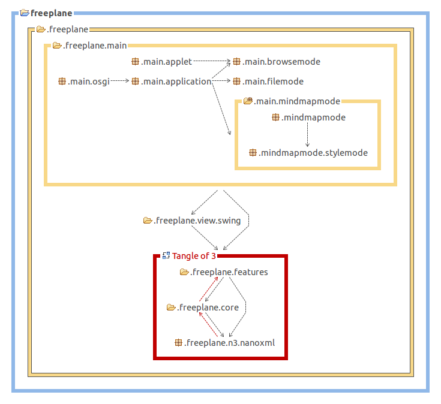
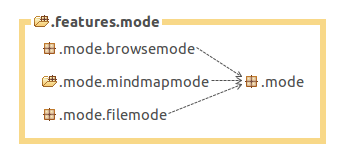
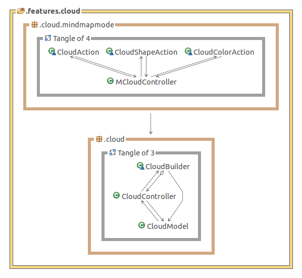
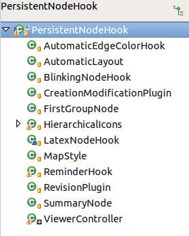
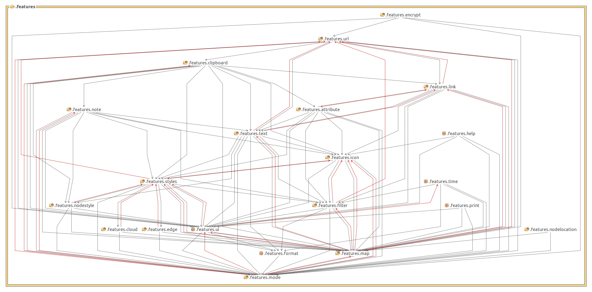
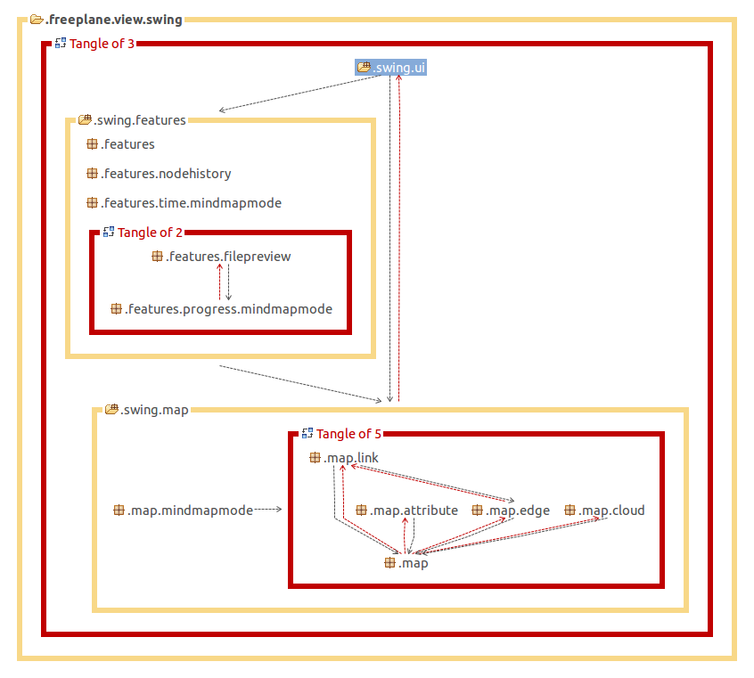

# Top level projects

Freeplane is a Java Swing application that has two major
variants:

* Standalone desktop application (full functionality)
    * This is the application most people know.
    * The distribution contains also a Portable version of the desktop application. It's just a different style of packaging the application to make it portable on USB sticks etc. but it's not another application.
* Browser applet (limited functionality)

The desktop application architecture is based on the [OSGi framework](http://www.osgi.org). It uses [Knoplerfish](http://www.knopflerfish.org/) version 2.3 as OSGi implementation.

The fact that Freeplane is build on OSGi has the following consequences:

* *All* of Freeplane's components are packaged as *OSGi bundles* (aka "plugins").
* Freeplane is launched in two steps:
1. The OSGi kernel, which is an external library, is configured and launched by Launcher.
2. The kernel initiates loading of all plugins.

**The browser applet does not use functionality contributed by the plug-ins.**

## Projects
All major components have their own project (toplevel directory in the
version control system and an Eclipse project) and they are build into
separate JARs.

    freeplane
    freeplane_mac
    freeplane_plugin_bugreport
    freeplane_plugin_help
    freeplane_plugin_latex
    freeplane_plugin_script
    freeplane_plugin_script_test
    freeplane_plugin_svg

All Freeplane projects but <tt>freeplane</tt> build a single <tt>plugin.jar</tt> (<tt>freeplane</tt> builds one plugin consisting of four JARs):

    $ cd "/Program Files/Freeplane"
    $ find . -name [pf][rl]\*.jar -o -name \*.MF
    core/org.freeplane.core/lib/freeplaneeditor.jar
    core/org.freeplane.core/lib/freeplanemac.jar
    core/org.freeplane.core/lib/freeplaneosgi.jar
    core/org.freeplane.core/lib/freeplaneviewer.jar
    core/org.freeplane.core/META-INF/MANIFEST.MF
    framework.jar
    plugins/org.freeplane.plugin.bugreport/lib/plugin.jar
    plugins/org.freeplane.plugin.bugreport/META-INF/MANIFEST.MF
    plugins/org.freeplane.plugin.latex/lib/plugin.jar
    plugins/org.freeplane.plugin.latex/META-INF/MANIFEST.MF
    plugins/org.freeplane.plugin.script/lib/plugin.jar
    plugins/org.freeplane.plugin.script/META-INF/MANIFEST.MF
    plugins/org.freeplane.plugin.svg/lib/plugin.jar
    plugins/org.freeplane.plugin.svg/META-INF/MANIFEST.MF

## Startup sequence

The startup sequence begins with essentially the following command (compare <tt>freeplane.sh</tt>):

    cd "/Program Files/Freeplane"
    java \
    -jar ./framework.jar" \
    -xargs ./init.xargs"

(The remaining arguments are mainly used for Knoplerfish configuration and memory settings.) The JAR is the Knoplerfish implementation JAR and <tt>init.xargs</tt> contains the directory where the plugin lookup should start:

    $ cat init.xargs
    -istart org.freeplane.core

This tells Knoplerfish to load the <tt>org.freeplane.core</tt> plugin first. Knoplerfish inspects <tt>core/org.freeplane.core/META-INF/MANIFEST.MF</tt> for the Activator class of this bundle <tt>org.freeplane.main.osgi.Activator</tt>.

Knoplerfish then runs <tt>org.freeplane.main.osgi.Activator.start()</tt> which then performs all the remaining startup steps:

* It creates an instance of <tt>org.freeplane.main.application.Freeplane</tt> which is responsible for the creation of controllers, actions, menus - short the complete basic application.
* Then it loads the other plugins from directory <tt>plugins</tt>, one after the other, by creating them from by loading their JARs and starting them (see <tt>ActivatorImpl.loadPlugins()</tt>)

    // org.freeplane.main.osgi.ActivatorImpl.startFramework()
    starter = new FreeplaneStarter();
    loadPlugins(context);
    final Controller controller = starter.createController();

# Freeplane core design
## Overview
Design aims for extendable set of packages with clear purposes and as few circular dependencies as possible.

Graphical overview over the package dependencies was created using structure analysis tool for Java [stan4j](http://stan4j.com/).
(Red lines show circular dependencies which are considered not good and demonstrate potential for improvement).

### .freeplane.features
Features implement bits of functionality assigned to a node, like an icon a note, an attribute etc, see [[#Features and their dependencies | below]].
### .freeplane.view.swing
Renderers, user interface listeners and renderer specific features, see [[#Features dependent on rendering components | below]].
### .freeplane.core
Utilities, classes and components used from different feature packages.

### .freeplane.n3.nanoxml
XML Parser derived from [nanoxml](http://devkix.com/nanoxml.php).
### .freeplane.main
Application builders which put all parts together and start the application:

* <tt>.freeplane.main.application</tt>: application specific parts and main method for running freeplane without the osgi plug-ins.
* <tt>.freeplane.main.applet</tt>: freeplane applet specific parts. Runs only browsemode in an applet.
* <tt>.freeplane.main.osgi</tt>: osgi specific parts loading and starting the plug-ins.
* <tt>.freeplane.main.mindmapmode</tt>, <tt>.freeplane.main.browsemode</tt>, <tt>.freeplane.main.filemode</tt>: mode factories.

## Features and their dependencies
### .features.map and .features.mode

The architecture aims for minimizing dependencies between features. 
For extensible architecture central classes (MapModel, NodeModel, ModeController, ReadManager, WriteManager) do not have to know about all the particular features. They serve as a container for their extensions (like in "The expension objects" pattern by Erich Gamma). This principle however is not satisfied by some old features representing e.g. node text, icons and map URL used for map loading.

Mode Controllers manage set of actions available to the user in each of the freeplane modes:
*MindMapMode
*BrowserMode
*FileMode

Mode specific packages can depend on their common package, other dependencies are not permitted.

Also there is a <tt>Controller</tt> which manages mode controllers themselves and mode independent actions like printing.

### Feature implementation patterns
#### Typical feature design
A feature usually consists of different parts, as in <tt>org.freeplane.features.cloud</tt>:

* a contribution to the node model; it holds the actual data, like a text, a color etc. (<tt>CloudModel</tt>),
* a controller class that integrates the feature into the application by registering actions and listeners (<tt>CloudController</tt>),
* Position of actions in menu is specified in <tt>/freeplane/resources/xml/mindmapmodemenu.xml</tt> and other mode specific menu configuration files.
* a builder class that is able to serialize and de-serialize the model into XML, i.e. to store the model within the map (<tt>CloudBuilder</tt>) which should register itself by <tt>>ReadManager</tt> and  <tt>>WriteManager</tt>,
* If a feature supplies own filter / find conditions it should register class implementing <tt>.features.filter.condition.IElementaryConditionController</tt> at <tt>ConditionFactory</tt> from the same package.
* a view which displays the element in a map; it is often implemented in a separate java package e.g.<tt>org.freeplane.view.swing.map.cloud</tt>,
* Editing operations are implemented in a sub package adding <tt>MCloudController</tt> with some actions. Mode independent feature packages must not depend on the mode specific parts.

Mode specific packages can depend on their common package, other dependencies are not permitted.

#### Framework class PersistentNodeHook
As an alternative to implementation of a feature as a package some easy extensions can be implemented as a class extending <tt>PersistentNodeHook</tt> which provides implementations of controller, builder and model. It creates an extension with xml compatible with FreeMind so that FreeMind can ignore it and load the map. The extension can be declared as related to a map or to a node.

Looks at classes from the type hierarchy given below for examples.

### Features independent on rendering components
Features with models and controllers not depending on view components with their interdependencies.

### Features dependent on rendering components
Some features depend on view elements. They are defined here.

TODO: to be continued...

# Plugins
### Structure of a plugin

A plugin is defined by its <tt>MANIFEST.MF</tt>, here an extract from the <tt>org.freeplane.core</tt> plugin (<tt>core/org.freeplane.core/META-INF/MANIFEST.MF</tt>):

    Bundle-Name: org.freeplane.core
    Bundle-Version: 1.0.1
    Bundle-ClassPath: lib/freeplaneviewer.jar,
    lib/freeplaneeditor.jar,
    lib/freeplanemac.jar,
    lib/freeplaneosgi.jar,
    lib/commons-lang-2.0.jar,
    lib/forms-1.0.5.jar,
    lib/gnu-regexp-1.1.4.jar,
    lib/SimplyHTML.jar,
    lib/jortho.jar
    Bundle-Activator: org.freeplane.main.osgi.Activator
    Import-Package: org.osgi.framework
    Export-Package: org.apache.commons.lang,
    org.freeplane.core.addins,
    org.freeplane.core.controller,
    [...]
    org.freeplane.view.swing.ui.mindmapmode

This defines the class path that is available within the bundle (<tt>Bundle-ClassPath</tt>), its version (versioning support is an important feature of OSGI), the list of packages that this plugin exports to others (<tt>Export-Package</tt>) and the Activator class of the bundle (<tt>Bundle-Activator</tt>).

The simplest OSGi plugin just needs a single class, the Activator class. If it should do some work then it should define an action, hooks them into the menu. So most of the work of creating a plugin will be spent setting up the directory/project structure.

Freeplane plug-in registers its factories as services <tt>IModeControllerExtensionProvider</tt> or <tt>IControllerExtensionProvider</tt> . They are called by Freeplane and can be used for installing themselves.

Freeplane Plug-ins are organized like [[#Typical_feature_design | features]] or [[#Framework_class_PersistentNodeHook | hooks]]. They can add their actions to menus and install their options into preferences panel from xml resources using methods <tt>ModeController.updateMenus(URL)</tt>, <tt>OptionPanelBuilder.load()</tt> and other Methods of <tt>OptionPanelBuilder</tt> and <tt>MenuBuilder</tt>. 

Look at existing plug-ins and core for examples.

### Create a new Plugin

A simple tool helps to get started with plugin development. It's an Ant Task named 'create-plugin' that is available from the <tt>freeplane_framework/ant</tt> directory. The task reads all required parameters from the command line. (If you want to do it non-interactively you have to create your own Ant task.)

See [Plugin development](/#/coding/Plugin_development ':ignore') for details.

<!-- ({Category:Coding}) -->

