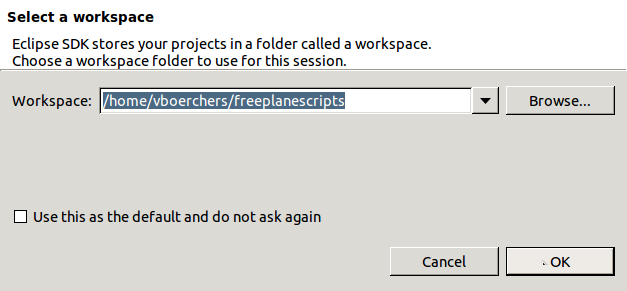
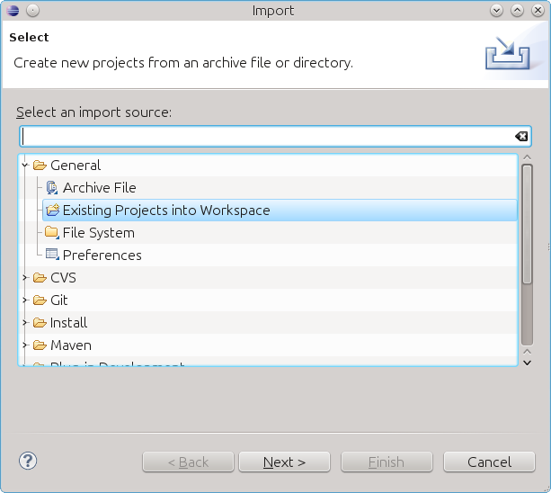
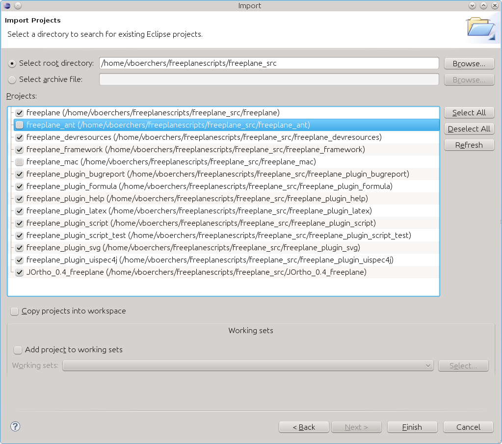
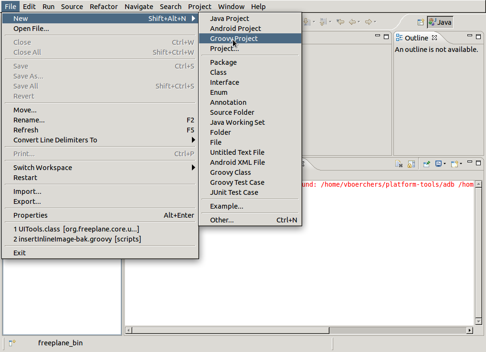
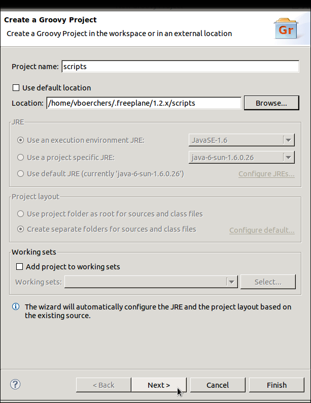
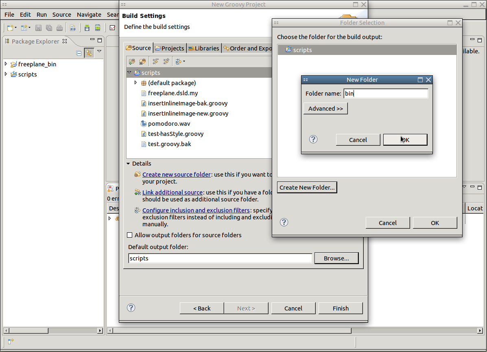
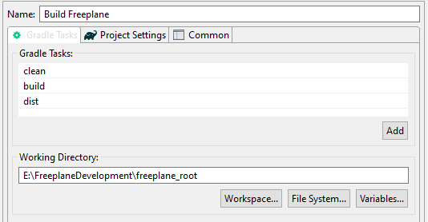

Integrated Development Environments (IDE) like [Eclipse](http://www.eclipse.org) or [Idea](http://www.jetbrains.com/idea/) make it much easier to edit Groovy scripts for Freeplane as in a normal text editor. Syntax highlighting, code completion, error detection, debugging and source navigation are extremely useful especially if you are not that experienced.

But it's more or less difficult for beginners to setup an IDE properly for Groovy scripting, so here's a step-by-step guide. If you have done that already you can skip to page [Edit scripts in Eclipse](Edit_scripts_in_Eclipse.md).

## Installations

* First download and install a Java Development Kit (JDK) -if you don't have it. There is a hyperlink on the Eclipse download page.
* Then download and install a "Eclipse IDE for Java Developers" or "Eclipse for RCP and RAP Developers" (the latter is more useful for regular Freeplane developers) from [Eclipse download page](http://www.eclipse.org/downloads/packages). Read how to unpack [*here*](http://www.clear.rice.edu/comp310/Eclipse/installation.html) (N.B. for Windows 7 it is not possible to unpack directly into c:/Program Files; no warning is given !) 
* Launch Eclipse for the first time and select some directory as your workspace root

* [Groovy-Eclipse plugin](https://github.com/groovy/groovy-eclipse/wiki). (Select at least "Groovy-Eclipse". - "Groovy Eclipse SDK" and "Extra Groovy Compilers" won't hurt.)
* Close Eclipse

## Setup workspace
### Install freeplane_src
This is for installing freeplane_src for the first time. For updating it, read [[#How to upgrade freeplane_src version|How to upgrade freeplane_src version]].

Download the current Freeplane source distribution (e.g. freeplane_src-1.2.13.tar.gz) and unpack it into the selected workspace. Unpacking this archive may require an additional program like 7zip, jzip or winzip on Windows (check by trying to open the file in the Explorer). Unpacking may need two steps:

1. In a program like 7zip open the archive freeplane_src-1.2.13.tar.gz. Most unpackers will allow directly extract into a directory, but jzip creates an intermediate freeplane_src-1.2.13.tar file
2. Rename freeplane-1.2.13 into freeplane_src and make sure this directory is in the workspace.
On the command line (Linux/Unix/Mac, Windows 10 now also supports <code>tar</code> but use <code>rename</code> instead of <code>mv</code>):
    cd <workspace> # your selected workspace, like ~/freeplanescripts
    tar -xzvf freeplane_src-1.2.13.tar.gz
    mv freeplane-1.2.13 freeplane_src
For Freeplane >= 1.5 you need to create a gradle build:

* You need at least gradle 2.x (install a gradle binary distribution if you need to)
* Create a full gradle build by issuing the following command in the freeplane_src directory:
    $ gradle clean build cleanEclipse eclipse
Alternatively you can use [[#How to set up your environment with the Eclipse Plug-ins for Gradle|the Eclipse Plug-ins for Gradle]].

For Freeplane < 1.5 you do not have to perform a build.

### Install groovy support
Freeplane's regular script directory <freeplaneuserdir>/scripts will be the script project directory where script development happens. To add special support for Freeplane scripting you have to copy the file *freeplane_bin/scripts/freeplane.dsld* to the script directory.
On the command line (assuming that ~/.freeplane/1.2.x/scripts is Freeplane's script directory; Linux/Unix/Mac):
    cd <workspace> # your selected workspace, like ~/freeplanescripts
    cp ./freeplane_bin/scripts/freeplane.dsld ~/.freeplane/1.2.x/scripts

## Create projects
### Import the Freeplane project(s)

The Freeplane sources in *freeplane_src* consist of multiple projects, which are prepared for Eclipse. We can simply import this projects into our Eclipse workspace:

1. Select File->Import...

2. Set the root directory to *<workspace>/freeplane_src* and select all projects except *freeplane-ant* and (unless this happens on a Mac) *freeplane-mac*. Then click "Finish".

### Create a Groovy project for the scripts
(You may have to click on "Other..." to see "Groovy project" option.)

2. Set the project name to "scripts", uncheck "Use default location" and enter the full path to the freeplane scripts folder (<freeplaneuserdir>/scripts):

3. Connect the scripts with Freeplane. 

    [[File:Eclipse-create-project-scripts-2.png|450px|border]]

4. Select a different build output folder. Otherwise a lot of .class files would pollute the scripts directory. This step is not required but helpful.

Done. You can proceed now with page [Edit scripts in Eclipse](Edit_scripts_in_Eclipse.md).

## How to upgrade freeplane_src version

In case you want to upgrade your environment to a newer freeplane_src you can remove the old version first with the following steps:

1. Right-click on your project(s) and choose Build Path > Configure Build Path... and then the Projects tab
2. On this tab: select all Freeplane (source) projects, click Remove and then OK
3. Close your project(s)
4. Select all Freeplane (source) projects, press delete and then OK
5. Go to your freeplane_src directory and delete all files
6. Now you can [[#Install freeplane_src|install freeplane_src]] for the new Freeplane version and [[#Import the Freeplane project(s)|import the Freeplane projects]] or use the steps for [[#How to set up your environment with the Eclipse Plug-ins for Gradle|the Eclipse Plug-ins for Gradle]]
7. Open your project(s)
8. Right-click on your project(s) and choose Build Path > Configure Build Path... and then the Projects tab
9. On this tab: click Add, add the Freeplane projects and click OK twice

Removing (step 1 and 2) and adding (step 8 and 9) the Freeplane projects to your build path are a foolproof way to ensure that your build path stays correct. You can skip them, but be sure to check if your build path is still correct because names and number of Freeplane project tend to change from time to time.

## How to set up your environment with the Eclipse Plug-ins for Gradle

This is an alternative for the steps in [[#Install freeplane_src|install freeplane_src]] and [[#Import the Freeplane project(s)|import the Freeplane projects]]

**Precondition**

You have "Buildship: Eclipse Plug-ins for Gradle" installed in Eclipse. It is probably already included with your Eclipse if you installed one of the newer versions.

**Steps**

10. Download freeplane_src-x.x.x.tar.gz
11. Extract to your Eclipse workspace: <code>tar -xvzf <downloads>/freeplane_src-x.x.x.tar.gz -C <workspace></code>
12. Rename directory freeplane-x.x.x to freeplane_root: <code>rename freeplane-x.x.x freeplane_root</code> (use <code>mv</code> for Linux/Unix/Mac)
13. In Eclipse click/select Run > Run configurations
14. Right click Gradle Task and choose New Configuration
15. Rename 'New_configuration' to 'Build Freeplane'
16. In Gradle Tasks add: clean, build and dist (so 3 tasks on 3 separate lines)
17. Click/select File System... > <workspace>/freeplane_root > OK
#; 

18. Click Run and wait till Gradle build has finished
19. Click/select File > Import > Existing Gradle Project > Next > Next
20. Specify the path to the <workspace>/freeplane_root directory in 'Project root directory' and click Finish. All projects are now imported as Gradle projects
21. Delete freeplane_ant (and freeplane_mac if you ar not on Mac)

Steps 4 to 9 are necessary to prevent an error in <code>freeplane_plugin_jsyntaxpane</code>: it needs to be built before it can be imported. It also prepares for running Freeplane from within Eclipse for [Debugging scripts](Debugging_scripts.md)

<!-- ({Category:Script}) -->

