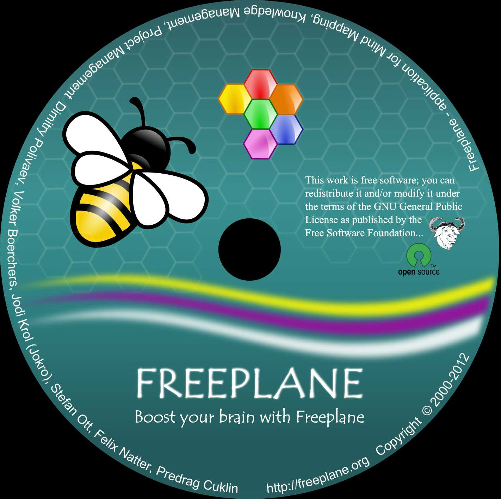
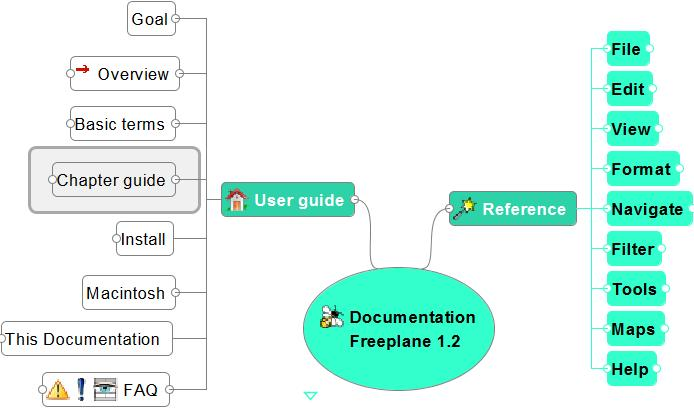

See [Help Previous Freeplane Versions](Help_Previous_Freeplane_Versions.md) for Freeplane 1.1.3.
The following is Help for Freeplane 1.2.x

# Installation (stable version)
The installation of the stable version for Windows is automatic. In other cases consult the installation for different operating systems below. For Macintosh also the windows-equivalent mouse buttons and special keys are described.  

* By default an English dictionary for the spell checker is installed. For other languages see below. 
* The menu structure is available in an increasingly number of [languages](https://www.freeplane.org/cgi-bin/translist.cgi). In the program, in menu *Tools > Preferences*, the language for the menu's can be changed. * For more information, see mind map *Index wiki* (upper right corner), branch Intall.

## Operating systems
Freeplane runs on any operationg system which has a recent version of Java insatalled.

* [Systems: Windows, Linux, Ubuntu, PortableApps, ..](Category:System.md)
* [Macintosh](Macintosh.md), also for mouse(button) handling.

## Install language
The Freeplane menu's are translated in many languages. For many languages spell check dictionaries are available.

* [spell check](/#/user-documentation/Spell_checker ':ignore')
* [translation](/#/contribute/Translation_How-To ':ignore')

If you want to supply a translation of the tutorial or documentation in your language, see [[Translation_How-To#Translation_of_Tutorial_or_Documentation_maps |***how to***]].

## Install add-ons
The standard functionality of Freeplane can be extended in different ways: 

* See [Add-ons_(install)](/#/getting-started/Add-ons_(install) ':ignore') for extensions and for customization of Freeplane.
* See [Academic liturature suite](http://www.docear.org). 
* See the Freeplane CD below for free icons, clipart and examples. (N.B. It is not necessary to create a CD to use its information)
  
    [[File:CD_cover_f.jpg|thumb|left]]

# Installation (development version)
Freeplane is being developed fast. If you want to use the newest functionality consider using a beta version. Besides you are invited to take part in testing the preview versions.

## Install beta version
A beta version is a complete version of Freeplane with all new functionality of the coming new stable version and which is being installed in the same way as the stable version, with a set-up file which will automatically install Java too. Go to [beta version](http://sourceforge.net/projects/freeplane/files/freeplane%20beta/), download the Freeplane-SetupXXX.exe and execute this file. For non-windows operating systems, see [Category:System](Category:System.md). Read [here](Category:Change_log.md) about changes between program versions.

## Install last preview version
A preview version contains new functionality the programmers are still working on. Installing a preview version  supposes that you have Java installed on your computer. 

Go to [preview](http://sourceforge.net/projects/freeplane/files/freeplane%20preview/) and download Freeplane_bin-XXXX.zip, in which XXXX is a shown version number. Unpack the zip file, at any place you want. If your intention is to only test the new version: In Windows click freeplane.exe; you could also connect freeplane.exe to the task bar. If you want the new version to automatically start if you click on any mind map, just overwrite the directories of the older version with those of the newer version. For other operating systems, see [Category:System](Category:System.md). Read [here](Category:Change_log.md) about changes between program versions.

# Tutorial
    [[File:Tutorial.jpg|thumb|right| [https://www.freeplane.org/mapsOnline/?map=freeplaneTutorial.mm Tutorial ]]]

The Tutorial gives a rather complete introduction to the main functions of Freeplane. It may help to first study the Guides. Details are discussed in the Documentation.

* In the Freeplane program, [*Help > Tutorial*](https://www.freeplane.org/mapsOnline/?map=freeplaneTutorial.mm) opens the Tutorial.
* The wiki [Freeplane Tutorial Extensions](Freeplane_Tutorial_Extensions.md) contains how-to information for use cases. These can be viewed without having Freeplane installed.
    

# Documentation

The Freeplane Documenation describes the details of each Freeplane function. Use Find and Filter to find out if a function exist for the type of action you are looking for. The Documentation also contains Frequently Asked Questions (FAQ).

* In the Freeplane program [Documentation *Help > Documentation*](https://www.freeplane.org/mapsOnline/?map=freeplane.mm) opens the Documentation. 
* In the Freeplane program *Help > Online documentation* gives the most actual information.
* This wiki gives detailed information on many topics, see the navigation menu of this page, <mm>[applet| Index wiki](:FreeplaneWiki.mm.md) </mm>.
 

# Publishing maps on line
Freeplane lets you export a map for publishing it on Internet or Intranet. If you have multiple maps to publish and maintain, it is more economic to use the procedure described [***here***](Publishing_maps_on_line.md). The maps in [Freeplane Tutorial Extensions](Freeplane_Tutorial_Extensions.md) are published in this way.

# Making a Freeplane animation or video
Freeplane maps can be used as a basis for creating an animation or video. There is a [How to guide](Videos_and_animations_How-to.md) with guidelines to create a high quality, low storage Freeplane animation or video.

# Open forum
Open forums give fast and easy access to the active user community of Freeplane. You can ask questions or post suggestions.

* [Discussions](https://github.com/freeplane/freeplane/discussions) is the main forum. You must register before posting.

# FAQ's
*the [Troubleshooting](Troubleshooting.md) page
*the [FAQ](FAQ.md) (Frequently Asked Questions)
*Report bugs [here](https://sourceforge.net/p/freeplane/bugs) or request new features [here](https://sourceforge.net/p/freeplane/featurerequests)   &nbsp; Please check first for existing issues using the **Search** box   &nbsp; Use the **Apply Filter** button to begin the search.

# Developers

* [Information for developers](Category:Developer.md)

# Previous versions

* [Freeplane 1.1.3](Help_Previous_Freeplane_Versions.md)

<!-- ({Category:Documentation})  ({Category:Documentation}) -->

# This wiki

Many pages on this wiki are tagged at the end of the page with Categories. You can click on the Category at the end of the page to display an index of all pages of the same Category. The  categories and pages are summarized in the mind map *Index wiki* on the right.

You are invited to use this wiki to share information and tips about Freeplane and its features. You can create new pages and edit all existing pages including this one after you [register and log in](https://www.freeplane.org/wiki/index.php?title=Special:UserLogin&returnto=Main_Page). 

NOTE: because of spammer attacks, editing of this wiki is now only allowed for registered wiki editors. If you want to become a wiki editor, [write](http://sourceforge.net/apps/phpbb/freeplane/viewforum.php?f=1) to the Freeplane team.

You can subscribe to [atom feed](https://www.freeplane.org/wiki/index.php?title=Special:RecentChanges&feed=atom) to be informed about all changes in this wiki. Using [this web service](http://www.feedmyinbox.com/) you can get daily e-mail notifications whenever the content changes. The same service can also be used for notifications about any changes to the project pages on SourceForge.

# Links

* [open clipart](http://openclipart.org/) and [clker](http://www.clker.com/) free clipart which can be used in Freeplane
* With [MetaMindMaps](https://www.freeplane.org/forum2012/viewtopic.php?f=1&t=249) it is possible to automatically generate a map of maps. If you use Norton, tempory switch of SONAR to install the program. Be aware that private data might leave your map.

