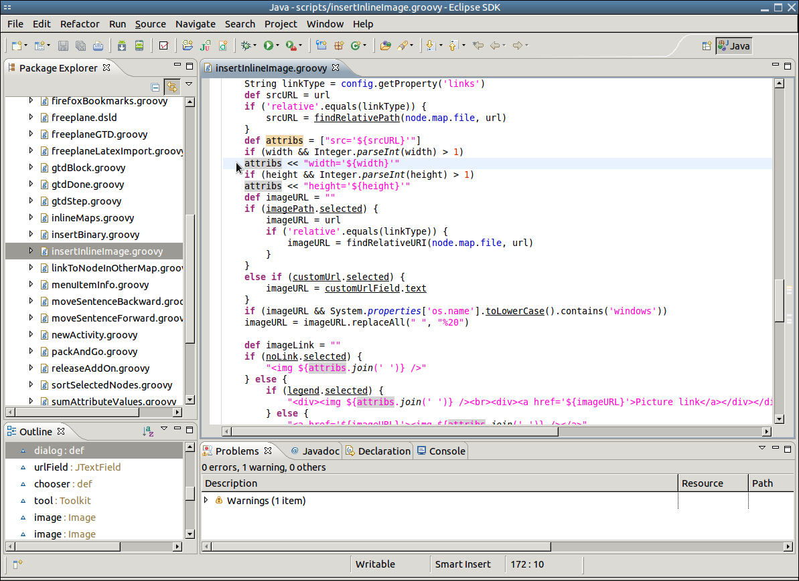
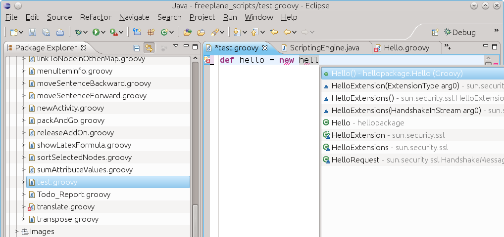
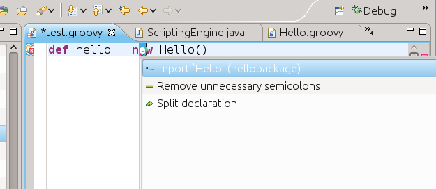

After the installation of the [Scripting environment](Scripting_environment_setup.md) you can start editing scripts. You might also be interested in [debugging scripts](Debugging_scripts.md)

This is what it looks like after opening a script via *Ctrl+Shift+R*:



## Code completion and quickfixes

Eclipse helps you quite a lot in avoiding and fixing errors. Here are some examples. 

Let's assume that you have created a class in a file Hello.groovy that you want to use in another script:
```groovy
package hellopackage

class Hello {
    def hello() {
        c.statusInfo = "Hello world!"
    }
}
```

When we want to use class Hello we have to consider that it is defined in the package "hellopackage". Let's use Eclipse' editing aids to use it: After entering *def hello = new hell* hit Ctrl+Space



You will see that there is an error since the required *"import hellopackage"* is unfortunately not added automatically (as it is for imported Java classes). But the small red "x" indicates that a "Quick fix" is available which you can select either by clicking on the "x" or by hitting Ctrl+1



After selecting the first suggestion by hitting *Enter* you will be done:


My tip: Test what happens if you type *Ctrl+Space* whenever you think that Eclipse might have an idea what you are about to type. The idea is: You do the creative work and and Eclipse cares for the tedious details of exact naming and locating objects.

## Magic keys

* Ctrl+Space
    * Initiates content assist, completes typed texts.
    * Import declarations for completed types are automatically added.
    * Example: type "str" (without the quotes) and hit ALT space.
* F3
    * Navigates to the definition of the variable/class under the cursor.
    * This also works for Java and Freeplane classes - allowes to lookup details of the class.
* ALT+Cursor_Left
    * Navigates to the last remembered location.
* Shift+Ctrl+T
    * Open a type (e.g. a class or interface).
    * Try entering "proxy" and select the Proxy from org.freeplane.plugin.script.proxy
    * Proxy is the API definition.
* Shift+Ctrl+R
    * Use this to open a script
* Ctrl+1
    * [Quickfix](http://help.eclipse.org/galileo/index.jsp?topic=/org.eclipse.jdt.doc.user/concepts/concept-quickfix-assist.htm)

## Making available groovy classes to your mind map
If in Eclipse you define and run Hello.groovy, Eclipse compiles and saves it as Hello.class in the build output folder you specified above. If you supplied a package name in the script e.g. <tt>package hellopackage</tt>, this name is used as a subdirectory, hellopackage/Hello.class. If you used the default (which it advised for scripts), it is just Hello.class.

* Open Freeplane and open Tools > Preferences > Plugins. On the last row add the path to Eclipse' build output folder.
* If you followed the procedure above the build output folder is <tt>scripts/bin</tt> in the Freeplane user directory. In this case simply enter <tt>scripts/bin</tt>.
* If you have chosen some other directory (e.g. one in the Eclipse workspace) you have to specify the full path.

**In Windows 7 with non-English localization** this has the following complication: Suppose the full path of the build output folder is shown in a Dutch Windows 7 as *C:/Gebruikers/Beheerder/workspaceFP/scripts/bin* then the script class path must be *C:\Users\Beheerder\workspaceFP\scripts\bin* since Windows 7 translates the real path *C:\Users* to Dutch *C:\Beheerder*. Furthermore note that all slashes MUST BE backslashes on Windows. You could avoid these complications by using the Freeplane script directory directly in Eclipse as described above.

* To take effect, restart Freeplane. (In case of problems, check the log file if Freeplane did could install the path).

## Script debugging
See [debugging scripts](Debugging_scripts.md).

<!-- ({Category:Script}) -->

