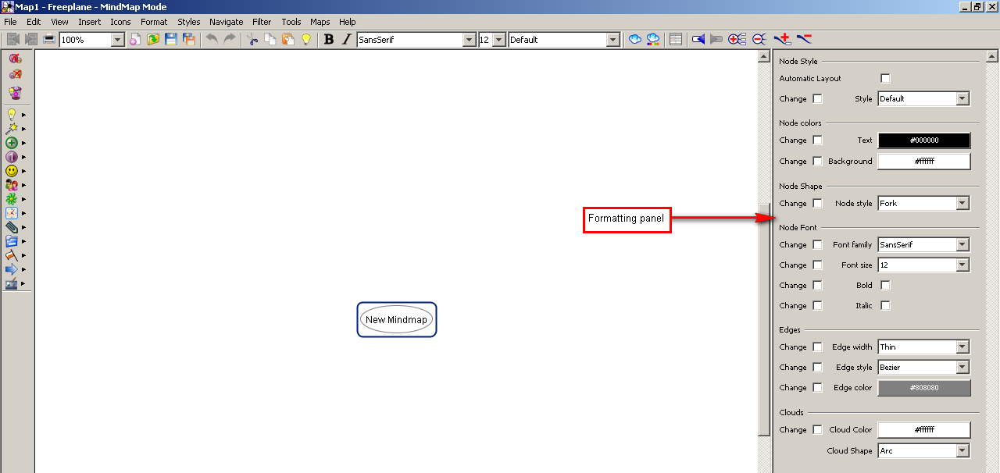
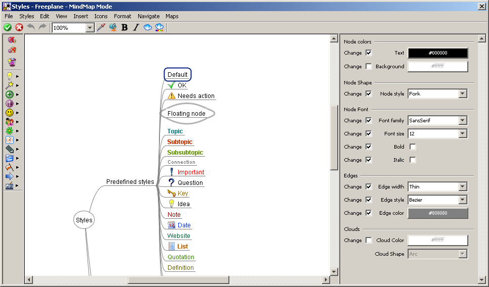

The style defines the appearence of node: colors, shape and font of node, edges and clouds; style can also add icons to node. Each node can be formated accordingly to a style. 

## Introducing styles

Freeplane provides default styles and user can add his own styles. Since Freeplane release 1.2, styles allow to: 

#change node formats quickly through the Tool panel (use "View&rarr;Controls&rarr;Tool Panel" to display/hide the panel on the right, screen capture (a bit outdated): ) 
#change node style by choosing a style among styles list (use the combo "style" in Freeplane's main toolbar, screen capture: ) 
#define you own styles through a styles editor (use "Styles&rarr;Edit styles ...", screen capture: ). &nbsp;

Originally each node has the "default" style. Node can be assigned another appearance with solution 1 or 2 described above. If automatic layout is on, the node is assigned the style corresponding to its level in the map. It's also possible to automaticly format node using [Conditional node styles](Conditional_node_styles.md).

Styles are saved in the map itself. The default styles for new maps are defined by the **[map template](Map_templates.md)** which can be edited like any other map.

## Changing style of a node

Changing the style automatically applies to all selected nodes. The node style can be changed: 

1. by selecting a style name in the toolbar styles list or
2. by changing selected style parameters.

While the first variant applies a defined style the latter creates an individual style of a node.

The following style parameters require further explanation:
### Format
Formats allows to apply a special data format, e.g. a special or number date format. If for instance a date has the standard format 28/12/2012 it can be reformatted as 12/28/2012 by applying the format mm/dd/yyyy to the node. See [Data recognition and data formats](Data_recognition_and_data_formats.md) for details.

Another application of the format is to define text templates, such as a prefix like "Beware: ". In text templates "%s" represent the original node text like in "Beware: %s".

By setting format to "Text" you switch all formatting off.

## Create a style from the mind map editor

*select a node, then go to menu "Styles&rarr;Create new style from selection",&nbsp;enter new style name. Result: a new style is immediately available through the combo "style" in Freeplane's main toolbar and can now be applied to other nodes.

## Managing styles with the styles editor

**To manage styles you need first to open the styles editor:** 

*menu "Styles&rarr;Edit styles". Result: a map containing all styles is displayed.

There you can modify all defined styles&nbsp;: either styles provided by default with Freeplane, or add/change your own styles. Note that's its allowed to remove default freeplane's styles.  

**To add your own style:** 

*in the styles editor, choose the style with the nearest format of the style you want to create, right click on this style, select in the contextual menu "Save as new style...", enter new style name. Result: a new style is added and appears in the user's styles branch.

You can now fully define the style with the formatting panel. Close the style editor. Your new style is available for immediate use in toolbar's style list. Tip&nbsp;: you can also create a new style from a main map's node with the command "Styles&rarr;New style from selection". 

**To rename a user style: **  

*in the styles editor, select you style, right click, select in the contextual menu "Save as new style...", enter the new name you want, remove the old style entry. 

**To change the display order of styles in the main toolbar styles list:** 

*in the styles editor, move up / down branchs or styles. 

## Pre-defined styles
Some predefined styles are available in Freeplane. You can either use them "as they are" or change them as it's convient for you. Two pre-defined styles named "Details" and "Notes" have a particular behaviour because they are used  to format Node Details and Node Notes :

* Font and colors of node details is controlled by style "Details"
* Font of notes (not the color) is controlled by style "Notes".

## Other style features

*menu "Styles&rarr;Copy styles..." imports, in the current map, styles from an other mindmap.

*menu "Styles&rarr;Redefine style" redefine node style based on current node formats. It changes formats of all nodes using this style.

## See also

[Map templates](Map_templates.md)

  

<!-- ({Category:Documentation}) -->

